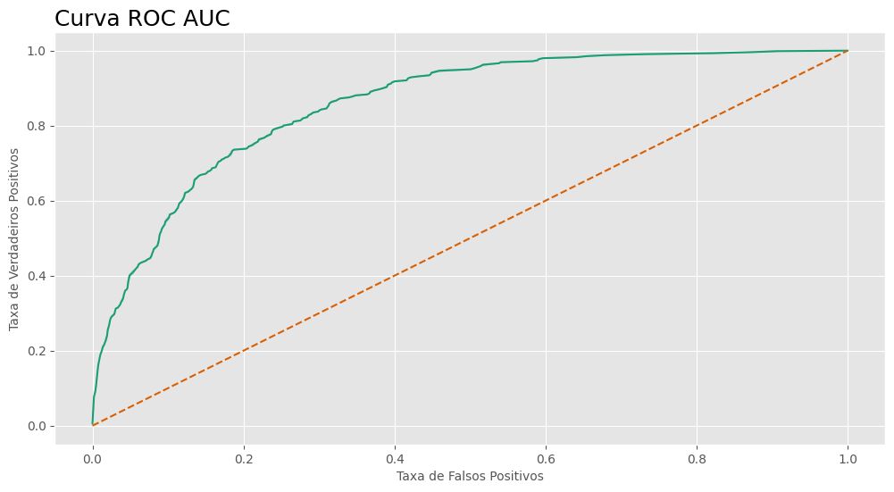
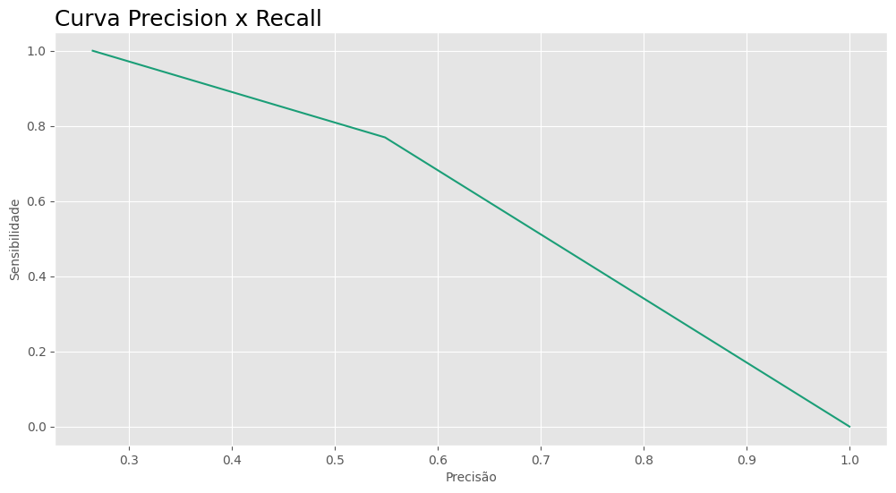
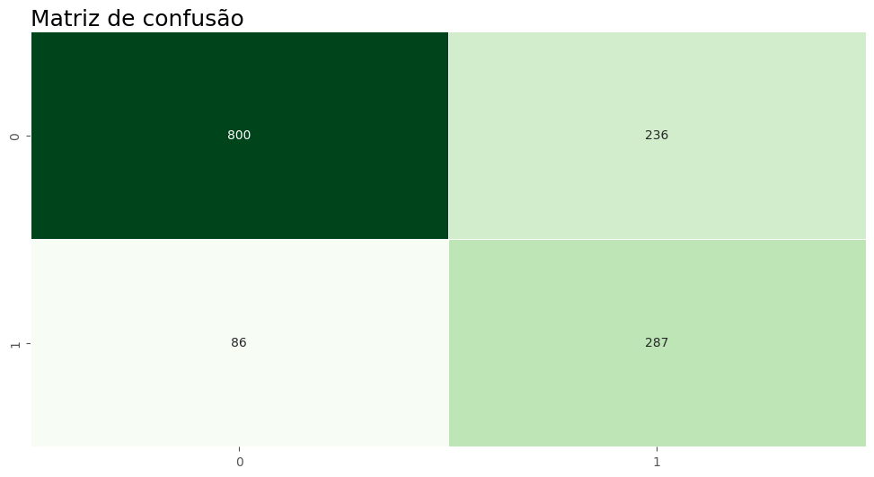

# Predição de Churn com Machine Learning 📞

## Conteúdo

- [Introdução](#introdução)
- [Metas e objetivos](#metas-e-objetivos)
- [Dados](#dados)
- [Métodos e modelos](#métodos-e-modelos)
- [Resultados](#resultados)
- [Ferramentas utilizadas](#ferramentas-utilizadas)

## Introdução
O dataset Telco Customer Churn contêm informações sobre uma empresa fictícia de telecomunicações que forneceu serviços de telefone residencial e Internet para 7043 clientes na Califórnia no terceiro trimestre. Eles indicam quais clientes deixaram, permaneceram ou se inscreveram para os seus serviços.

## Metas e objetivos
O objetivo deste projeto é (1) explorar os dados em busca de insights sobre a taxa de Churn da Telco, e (2) construir um modelo de machine learning capaz de predizer clientes que darão churn.

## Dados
|Coluna|Descrição|
|---|---|
|`customerID`|Identificador único dos clientes|
|`gender`|Gênero|
|`SeniorCitizen`|É idoso?|
|`Partner`|Possui parceiro?|
|`Dependents`|Possui dependentes?|
|`tenure`|Tempo de relacionamento (em meses)|
|`PhoneService`|Possui serviço telefonico?|
|`MultipleLines`|Possui multiplas linhas?(Sim, não, não possui serviço telefonico)|
|`InternetService`|Provedor de serviços de internet (DSL, Fibra ou não)|
|`OnlineSecurity`|Possui seguro online?|
|`OnlineBackup`|Possui backup online?|
|`DeviceProtection`|Possui proteção do dispositivo?|
|`TechSupport`|Tem suporte técnico?|
|`StreamingTV`|Possui streaming de TV?|
|`StreamingMovies`|Possui streaming de Filmes?|
|`Contract`|Tipo de contrato(mês-a-mês, anual ou bi-anual)|
|`PaperlessBilling`|Recebe boletos?|
|`PaymentMethod`|Método de pagamento|
|`MonthlyCharges`|Taxa de serviço|
|`TotalCharges`|Total pago pelo cliente|
|`Churn`|Alvo|

Os dados podem ser encontrados no [Kaggle](https://www.kaggle.com/datasets/blastchar/telco-customer-churn/data) e foram disponibilizados por BlastChar.

## Métodos e modelos
#### Pré-processamento e otimizações
- Scikit-learn, Optuna, Category Encoders, Feature Engine.
#### Modelos
- RandomForest, CatBoost.
#### Métricas de avaliação
- Acurácia, F1 Score, ROC AUC e MCC.

## Resultados
### Conclusões da Análise Exploratória
- Clientes com menor tempo de relacionamento com a Telco tem maior probabilidade de Churn, são necessárias ações para aumentar a fidelização de clientes novos, especialmente no recorte dos primeiros 18 meses;
- Pessoas em planos com mensalidade maior tem maior probabilidade de Churn, é necessário checar o atendimento nestes planos e revisar os preços;
- Planos mensais são aquele com maior taxa de Churn, gerar incetivos para assinatura de planos mais longos pode ser uma solução;
- Pessoas adeptas de planos de pagamento automáticos tem uma probabilidade significamente menor de Churn, é interessante incentivar sua assinatura.

**Insights pós-análise:** É possível criar um plano de ação em forma de campanhas de marketing e novos planos de serviço para diminuir a taxa de Churn na Telco, algumas opções seriam (1) oferecer um plano anual com desconto caso o meio de pagamento escolhido seja Bank transnfer ou Credit card, (2) revisar preço e dar descontos para clientes com mais tempo de relacionamento que possuem planos mais caros para renovação anual ou bianual.

### Métricas do modelo

|Métrica|Resultado|
|---|---|
|**Acurácia**|0.7786|
|**F1 Score**|0.6502|
|**ROC AUC**|0.8585|
|**MCC**|0.5089|

### Visualizações

## Ferramentas utilizadas

## Contatos
- **E-mail:** andreluizlcons@gmail.com
- **LinkedIn:** https://www.linkedin.com/in/andreluizls1/
- **Telefone:** +55 88999934237