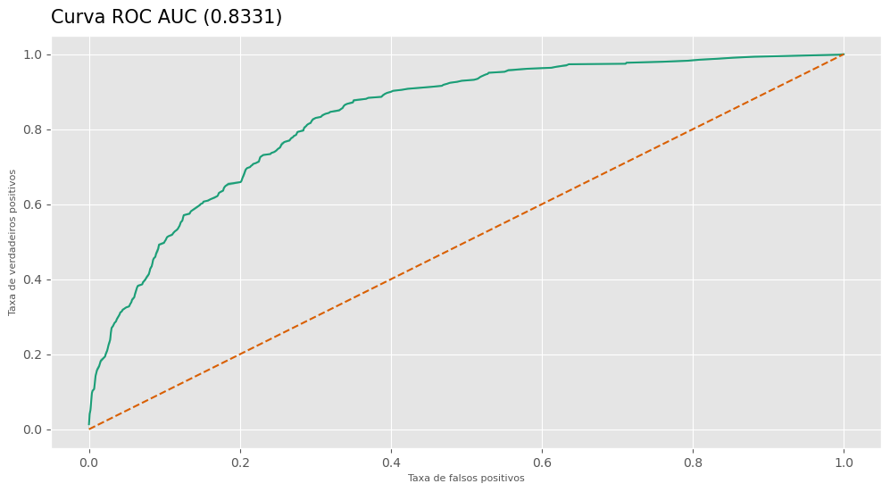
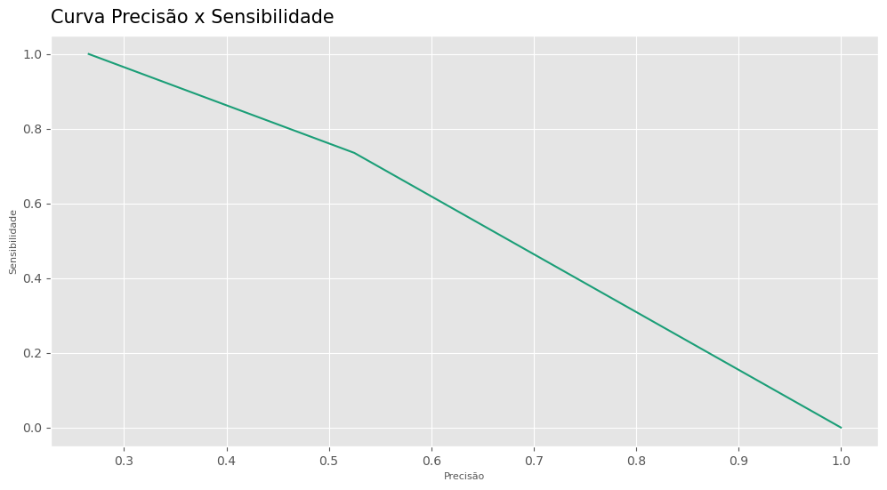
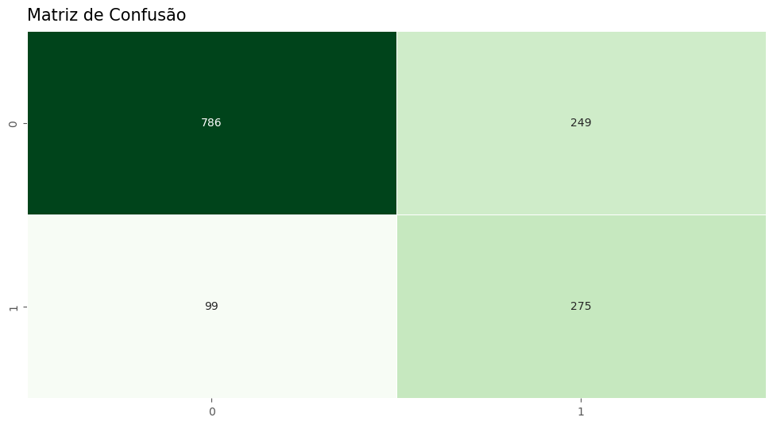

# Predição de Churn com Machine Learning - Telco Customer Churn 📞

## Conteúdo

- [Introdução](#introdução)
- [Metas e objetivos](#metas-e-objetivos)
- [Dados](#dados)
- [Métodos e modelos](#métodos-e-modelos)
- [Resultados](#resultados)
- [Ferramentas utilizadas](#ferramentas-utilizadas)

## Introdução
O dataset Telco Customer Churn contêm informações sobre uma empresa fictícia de telecomunicações que forneceu serviços de telefone residencial e Internet para 7043 clientes na Califórnia no terceiro trimestre. Eles indicam quais clientes deixaram, permaneceram ou se inscreveram para os seus serviços. 

## Metas e objetivos
Este projeto tem o intuíto de realizar uma breve análise exploratória e construir um modelo de Machine Learning para predição de Churn.

## Dados
|Coluna|Descrição|
|---|---|
|`customerID`|Identificador único dos clientes|
|`gender`|Gênero|
|`SeniorCitizen`|É idoso?|
|`Partner`|Possui parceiro?|
|`Dependents`|Possui dependentes?|
|`tenure`|Tempo de relacionamento (em meses)|
|`PhoneService`|Possui serviço telefonico?|
|`MultipleLines`|Possui multiplas linhas?(Sim, não, não possui serviço telefonico)|
|`InternetService`|Provedor de serviços de internet (DSL, Fibra ou não)|
|`OnlineSecurity`|Possui seguro online?|
|`OnlineBackup`|Possui backup online?|
|`DeviceProtection`|Possui proteção do dispositivo?|
|`TechSupport`|Tem suporte técnico?|
|`StreamingTV`|Possui streaming de TV?|
|`StreamingMovies`|Possui streaming de Filmes?|
|`Contract`|Tipo de contrato(mês-a-mês, anual ou bi-anual)|
|`PaperlessBilling`|Recebe boletos?|
|`PaymentMethod`|Método de pagamento|
|`MonthlyCharges`|Taxa de serviço|
|`TotalCharges`|Total pago pelo cliente|
|`Churn`|Alvo|

Os dados podem ser encontrados no [Kaggle](https://www.kaggle.com/datasets/blastchar/telco-customer-churn/data) e foram disponibilizados por BlastChar.

## Métodos e modelos
#### Pré-processamento e otimizações
- Scikit-learn, Optuna, Category Encoders, Feature Engine.
#### Modelo
- LightGBM Classifier.
#### Métricas de avaliação
- Recall, Precision, F1 Score, ROC AUC.

## Resultados
### Análise Exploratória de Dados
- Clientes com maior tempo de contrato tem maior probabilidade de permanecer utilizando os serviços da Telco, é interessante premiar ou realizar ações de marketing com estes;
- Idosos tem uma proporção grande de Churn em relação ao seu volume dentro da base, devem ser tomadas ações em relação isso;
- É necessário buscar melhorar os serviços para: (1) novos clientes, (2) clientes com maior valor de taxas de serviço;
- Oferer um plano semestral pode estimular clientes da modalidade mês-a-mês a fazerem contratos mais longos (que sãos os com menor probabilida de de Churn);
- Oferta de serviços como suporte técnico tem peso na permanência dos clientes, deve-se buscar formas de facilitar o acesso. 
### Modelo de classificação
#### Métricas de validação
|Métrica|Resultado|
|---|---|
|Recall| 0.7580|
|Precision| 0.5651|
|F1 Score| 0.6475|
|ROC AUC| 0.8545|

#### Métricas de teste
|Métrica|Resultado|
|---|---|
|Recall| 0.7352|
|Precision| 0.5248|
|F1 Score| 0.6124|
|ROC AUC| 0.8330|

#### Visualizações

## Ferramentas utilizadas
